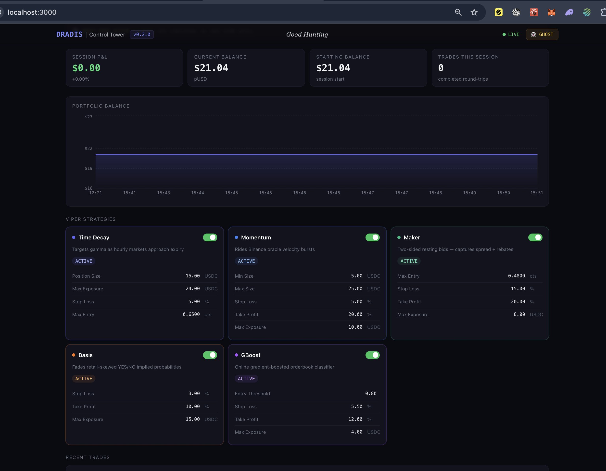

# DRADIS

> **Direct Reaction And Dynamic Intelligence System** — Low-latency Rust prediction-market trading bot for Polymarket. Six autonomous strategies (Momentum, Maker, Arbitrage, Time Decay, Basis, GBoost ML), real-time Next.js Control Tower, and an LLM Advisor that delivers optimization recommendations via Ollama (local or remote) + Telegram & OpenClaw.


[](https://openclaw.ai)


**WARNING**: This is **ALPHA** software. You will probably lose money. Start in GHOST mode and tune before going live. Make sure to regularly pull updates as our own LLM advises on config and Viper strategy impls daily. 

---

## ⚡ Quick Start

```bash
# 1. Clone and configure
git clone https://github.com/youruser/dradis.git && cd dradis
cp .env.example .env          # fill in POLYMARKET_PRIVATE_KEY, POLYGON_RPC_URL, TELEGRAM tokens, etc.
cp deploy-multi.sh.example deploy-multi.sh  # fill in HOST, USER, KEY
```

```bash
# 2. Deploy (builds Rust engine + Control Tower, starts Ollama, pulls model)
chmod +x deploy-multi.sh && ./deploy-multi.sh
```

After ~5 minutes the stack is live:

| Service | URL |
|---|---|
| **Control Tower** | `http://<host>:3002` |
| **DRADIS REST API** | `http://<host>:9000/api/health` |
| **Ollama** | `http://<host>:11434/api/tags` (internal) |

**Verify Ollama is healthy** (run from your local machine):
```bash
curl -s http://<host>:11434/api/tags | python3 -m json.tool
```

> **Prerequisites:** Docker on the remote host, Rust 1.95+ only needed for local builds.  
> See the [Control Tower](#️-control-tower--the-dashboard) section for dashboard setup and the [Setup](#setup) section for all tunable parameters.

---

## 🛰️ Tactical Overview

DRADIS is not just a bot; it is a comprehensive trading automation platform for prediction markets like Polymarket. Built in Rust for maximum concurrency and memory safety, it evaluates the selected markets every 50ms, coordinating multiple autonomous strategies to preserve capital and place orders where it sees inefficiencies.

Unlike standard linear scripts, DRADIS uses a Tokio-powered orchestrator to manage telemetry (WebSockets), signal processing (**Raptors** — the recon layer that scouts external signals like Binance price feeds and funding rates), and tactical execution across six distinct **Viper** strategy classes. A built-in **LLM Advisor** periodically analyzes completed trades and delivers actionable optimization recommendations directly to your Telegram channel — using any locally-running Ollama model you choose. You can also build your own Viper using our [implementation guide](docs/CUSTOM_STRATEGY.md).

---

## 🛠️ The Architecture (The CIC)

The core of DRADIS is the Orchestrator. It acts as the ship's brain, maintaining the primary data link to the Polymarket CLOB and Binance Oracles.

- **Parallel Dispatch**: Every heartbeat (50ms), the CIC polls all registered strategies in parallel.
- **Isolated Pits**: Each strategy operates with its own independent capital budget and position book. A "whiplash" in one sector won't compromise the fuel (USDC) of another.
- **Signal Filtering**: Includes a built-in OBI (Order Book Imbalance) Veto at -0.60 to prevent launching into "toxic flow" or distribution walls.
- **Strategy Timeout**: Each strategy evaluation is wrapped in a hard 500ms timeout. A hung strategy (e.g. GBoost mutex contention during retrain) is skipped for that tick — the engine never freezes.
- **REST API**: An axum server on `:9000` exposes live config, P&L history, and trade data to the Control Tower UI.

```
┌─────────────────────┐   ┌─────────────────────┐
│  Raptor Squadron    │   │  Polymarket CLOB    │
│ (Binance Price /    │   │  (WebSocket Feed)   │
│  Funding Oracles)   │   │                     │
└──────────┬──────────┘   └──────────┬──────────┘
           │                         │
           └────────────┬────────────┘
                        ▼
           ┌────────────────────────┐
           │   Orchestrator (CIC)   │◄──── axum REST API (:9000)
           │     50ms Heartbeat     │           │
           └────────────┬───────────┘           │
                        │  parallel dispatch    ▼
          ┌─────────────┼──────────────┬────────────────┐
          ▼             ▼              ▼                ▼
   ┌────────────┐ ┌──────────┐ ┌──────────────┐ ┌──────────────┐
   │ Momentum   │ │  Maker   │ │  Arbitrage / │ │   Gradient   │
   │            │ │          │ │  TimeDecay / │ │   Boost      │
   │            │ │          │ │   Basis      │ │              │
   └─────┬──────┘ └────┬─────┘ └──────┬───────┘ └──────┬───────┘
         └─────────────┼──────────────┴────────────────┘
                       ▼
           ┌───────────────────────┐
           │    Execution Layer    │
           │  OBI Gate · Fee Gate  │
           │  Circuit Breaker      │
           └───────────────────────┘

           ┌───────────────────────┐
           │   Control Tower UI    │  Next.js dashboard (:3002)
           │  Strategy toggles     │  ◄── PATCH /api/config
           │  P&L chart            │  ◄── GET  /api/pnl/history
           │  Trade log            │  ◄── GET  /api/trades
           └───────────────────────┘

           ┌───────────────────────┐     ┌────────────────┐
           │    LLM Advisor        │────►│  Ollama API    │
           │  (background task)    │     │  (your model)  │
           │  reads SQLite trades  │     └────────────────┘
           │  every N minutes      │
           └──────────┬────────────┘
                      │ recommendations
                      ▼
           ┌───────────────────────┐
           │   Telegram Channel    │
           └───────────────────────┘
```

---

## 🚀 The Viper Squadrons (Strategies)

DRADIS currently deploys six specialized Viper strategy classes. Each Viper is an autonomous tactical unit with its own capital budget, position book, and entry/exit logic — no Viper can compromise another's fuel.

- **Momentum**: Scans for high-velocity Binance moves. If a "target" moves $75 in 5 seconds, the Viper strikes the Polymarket book before it can reprice.
- **Maker**: Maintains a dual-sided presence on the Window venue, capturing the spread while managing net exposure.
- **Arbitrage**: Constantly monitors the price sum of YES/NO pairs, looking for sub-$1.00 opportunities in low-fee venues.
- **Time Decay**: Posts resting maker bids on both YES and NO of the Hourly venue during the theta window, earning the combined bid discount and settling at $1.00 with zero fee drag.
- **Basis/Funding**: Fades retail skew by comparing Polymarket sentiment against Binance perpetual funding rates.
- **GBoost**: Online gradient-boosted ML model (LogLoss) that learns from live orderbook + oracle features to predict near-term YES price direction, retraining continuously in the background.

---

## 🛸 The Raptor Squadron (Oracles)

Raptors are DRADIS's recon layer — lightweight signal scouts that fly ahead of the Vipers and report external intelligence back to the CIC. Each Raptor polls a specific data source on its own schedule and publishes a normalized signal the Viper strategies consume.

| Raptor | Source | Signal |
|---|---|---|
| **Price Raptor** | Binance Spot | BTC spot price, 5s/1s velocity, acceleration |
| **Funding Raptor** | Binance Perpetuals | Perpetual funding rate (smart-money sentiment) |
| *(future)* **Sports Raptor** | Line movement APIs | Betting line drift, public money % |
| *(future)* **Politics Raptor** | Polling aggregators | Approval drift, event probability shifts |

When multiple Raptors are active for a profile, the GBoost and Basis strategies fuse their signals as features — no single Raptor has veto power alone.

---

## 🖥️ Control Tower — The Dashboard

DRADIS ships with a real-time web dashboard called **Control Tower** built on Next.js 15 + Tailwind CSS.



### Features

| Panel | What it shows |
|---|---|
| **Status Bar** | Engine online/offline indicator, GHOST mode badge, active market, current BTC Raptor price, session P&L |
| **P&L Chart** | Rolling equity curve across recent snapshots (Recharts area chart) |
| **Viper Squadron Cards** | One card per strategy — live enabled/disabled toggle, all tunable parameters editable inline without a restart |
| **Trade Log** | Last N completed trades with strategy, side, entry/exit prices, shares, P&L, and exit reason |

### Live Config Editing

Every parameter shown in the Viper cards maps directly to the runtime `DynamicConfig`. Editing a value and pressing Enter (or toggling the switch) sends a `PATCH /api/config` request to the DRADIS engine — **no restart required**. Changes take effect on the next 50ms tick.

### Authentication

Control Tower is protected by HTTP Basic Auth in production. Set `CT_USERNAME` and `CT_PASSWORD` in your `.env` file. The middleware is skipped automatically in local dev when these vars are absent.

```bash
# .env (production)
CT_USERNAME=starbuck
CT_PASSWORD=your-strong-password
```
---

## 🤖 LLM Advisor

The LLM Advisor is an optional background task that periodically analyzes your completed trades and sends **plain-English optimization recommendations** directly to your Telegram channel. It is powered by a locally-running [Ollama](https://ollama.com) instance — no data ever leaves your machine or server.

### What it does

Every `LLM_ADVISOR_INTERVAL_SECS` (default: 30 minutes) the advisor:

1. Fetches the last `LLM_ADVISOR_TRADES_LOOKBACK` (default: 20) completed trades from SQLite
2. Computes a per-strategy win/loss/P&L breakdown
3. Sends the trade data + session context to Ollama with a detailed system prompt that explains all six Vipers, OBI semantics, Polymarket fee structure, and every tunable `DynamicConfig` parameter
4. Receives a structured analysis back from the model
5. Posts the recommendations to your Telegram channel

A typical message looks like:

```
📊 DRADIS LLM ADVISOR
Session P&L: -$1.42  |  Trades analysed: 20

🔍 OBSERVATIONS
• 6 of 8 GBoost losses had entry_obi_y ≤ -0.80 — adversely stacked books at fill time
• Momentum avg hold 3s — MomentumDecay exits firing immediately after entry
• BasisStrategy win rate 0% over 4 trades — oracle flat but funding signal absent

⚙️ RECOMMENDATIONS
1. gboost_obi_adverse_block: -0.25 → -0.15 — tighten to block severely adverse books
2. momentum_decay_exit_fraction: 0.20 → 0.30 — require stronger signal collapse before early exit
3. enable_basis: true → false — no confirming funding signal this session; reduces noise
4. gboost_entry_threshold: 0.85 → 0.90 — raise conviction bar; borderline signals losing money

🟢 KEEP ENABLED: Momentum, Arbitrage, TimeDecay
🔴 CONSIDER DISABLING: GBoost, Basis
```

### Configuration

```rust
// src/config.rs
pub const ENABLE_LLM_ADVISOR: bool = true;          // master switch (default: false)
pub const LLM_ADVISOR_INTERVAL_SECS: u64 = 1800;   // how often to run (30 min default)
pub const LLM_ADVISOR_TRADES_LOOKBACK: i64 = 20;   // trades per analysis window
pub const LLM_OLLAMA_URL: &str = "http://localhost:11434";  // Ollama base URL
pub const LLM_OLLAMA_MODEL: &str = "llama3.2";     // model name
```

Override the URL and model at runtime without rebuilding:

```bash
# .env or server environment
OLLAMA_URL=http://192.168.1.10:11434   # remote Ollama instance (GPU box, etc.)
OLLAMA_MODEL=mistral                    # any model installed in your Ollama
```

The advisor requires the same `TELEGRAM_BOT_TOKEN` and `TELEGRAM_CHAT_ID` env vars already used for trade alerts. If Telegram credentials are absent, the full analysis is written to the engine log instead.

### Bring Your Own Model

Any model that follows Ollama's instruction format works. Recommended options:

| Model | Size | Notes |
|---|---|---|
| `llama3.2` | 2–3 GB | Fast on CPU; good instruction following; **recommended default** |
| `llama3.1:8b` | 5 GB | Better reasoning; needs ≥8 GB RAM |
| `mistral` | 4 GB | Strong on structured output; good alternative |
| `qwen2.5:7b` | 5 GB | Excellent code/config reasoning; good for parameter suggestions |

Install a model:
```bash
ollama pull llama3.2
```

Point DRADIS at a remote Ollama instance (e.g. a GPU box on your LAN or a cloud GPU) via `OLLAMA_URL` — inference latency is irrelevant since the advisor runs on a slow background timer, not in the trading hot path.

### Profile defaults

| Profile | `ENABLE_LLM_ADVISOR` | Interval | Lookback |
|---|---|---|---|
| 🔴 Aggressive | `true` | 20 min | 25 trades |
| 🟡 Balanced | `true` | 30 min | 20 trades |
| 🟢 Conservative | `true` | 45 min | 15 trades |
| `config.rs` (live) | `false` | 30 min | 20 trades |

The live `config.rs` ships with the advisor **off by default** — flip `ENABLE_LLM_ADVISOR = true` when you have Ollama running.

---

## 🛡️ Safety Systems

- **Orphaned Position Detection**: Automatically "scuttles" one-sided hedged positions after 60s to prevent directional bleeding.
- **Fee Gates**: Hard-coded protection to ensure Taker strategies don't enter high-fee (1000 bps) environments.
- **Circuit Breaker**: Total system lockdown after 3 consecutive execution failures.

---

## ⚠️ Read This First

**This is experimental software. You will probably lose money. Start in GHOST mode and tune.**

- **Risk**: Momentum trades are directional and can get whiplashed. Arbitrage spreads are thin. Time decay positions can widen against you. None of this is guaranteed profit.
- **US Citizens**: Polymarket is rolling out US access under CFTC regulation via a waitlist. Check [polymarket.com](https://polymarket.com) for your current eligibility.
- **Competition**: Polymarket is full of well-funded, low-latency bots. This project is a learning exercise, not an edge.

---

## How It Works

The bot connects to Polymarket's CLOB via WebSocket for real-time orderbook data. **Raptor scouts** poll Binance for spot price, velocity, and perpetual futures funding rates. Every 50ms, the orchestrator evaluates all Viper strategies concurrently using the latest Raptor intelligence, then dispatches the resulting signals to the execution layer.

### Strategies

**Momentum** — Detects when Binance price moves sharply before Polymarket reprices.
- **Velocity trigger**: `BTC_MOMENTUM_THRESHOLD` = $75/5s (example).
- **Strike buffer**: `BTC_STRIKE_BUFFER` = $50.0 (example).
- **Gates**: Requires building acceleration and a strong 1s short-window confirmation.
- **Sizing**: Fractional Kelly scaling based on signal strength.

**Maker** — Posts passive resting bids on **both YES and NO simultaneously** on the **Window/Maker venue**.
- **Imbalance gate**: Skips bids if the book is heavily skewed against us.
- **Net exposure**: Risk is measured as the directional imbalance (`|YES − NO|`).

**Arbitrage** — Buys both YES and NO on the **Window/Daily venue** when combined asks are < $1.00 (net of fees).
- **Profit Threshold**: Exploits small inefficiencies in the low-fee venue.

**Time Decay** — Exploits price convergence toward $1.00 as markets approach expiry. Posts resting GTC maker bids on **both YES and NO** on the **Hourly venue** during the theta window, collecting the spread at 0% maker fee and settling at $1.00.

**Basis / Funding-Rate** — Fades retail skew on the **Window venue** using Binance funding rates as confirmation.
- **Thesis**: Fades amateur over-betting when smart money (funding) disagrees.

**GBoost / ML** — Online gradient-boosted binary classifier running on the **Window/Daily venue**.
- **Model**: `perpetual` crate `PerpetualBooster` with `LogLoss` objective.
- **Features (14)**: YES/NO OBI, best ask prices, spreads, Binance 5s/1s velocity, acceleration, funding rate, 60m oracle drift, oracle price, **time-to-expiry (normalised to [0,1])** — sourced from the active Raptor scouts, OBI change history.
- **Label**: `1.0` if YES bid rises within `GBOOST_LOOKAHEAD_TICKS` ticks, `0.0` otherwise.
- **Retraining**: Every `GBOOST_RETRAIN_EVERY_N` ticks via `tokio::task::spawn_blocking` (never blocks the async executor). Requires `GBOOST_MIN_TRAINING_SAMPLES` snapshots before first model is available.
- **Persistence**: Model serialized to `GBOOST_MODEL_PATH` after each retrain and warm-loaded on startup. The filename is versioned (e.g. `gboost_model_v14f.json`) — see FAQ below.
- **Entry**: Buys YES if `P(UP) ≥ GBOOST_ENTRY_THRESHOLD`; buys NO if `P(UP) ≤ 1 − GBOOST_ENTRY_THRESHOLD`.
- **Exit**: Take-profit at `GBOOST_TARGET_PROFIT_PERCENT`, stop-loss at `GBOOST_STOP_LOSS_PERCENT` (after `GBOOST_MIN_HOLD_SECS`), or signal reversal when model flips conviction.

**Custom Strategy** — Develop and link your own strategies. See [CUSTOM_STRATEGY.md](docs/CUSTOM_STRATEGY.md).

---

### Strategy Segregation (Example Profile)

| Strategy | Capital Budget | Risk Model | Primary Venue |
|---|---|---|---------------|
| MomentumStrategy | `$15` | Gross one-sided | **Hourly**    |
| MakerStrategy | `$12` | Net \|YES−NO\| | **Window**    |
| ArbitrageStrategy | `$35` per leg | Gross hedged | **Window**    |
| TimeDecayStrategy | `$36` per leg | Gross hedged | **Hourly**    |
| BasisStrategy | `$15` | Gross one-sided | **Window**    |
| GboostStrategy | `$4` | Gross one-sided | **Window**    |

---

## Performance Tracking

The bot automatically records every completed trade into a daily CSV file for easy analysis.

- **Location**: `logs/{token}-trades_YYYY-MM-DD.csv` (e.g. `btc-trades_2026-04-29.csv`)
- **Columns**: Timestamp, Strategy, Market, Side (YES/NO), Entry Price, Exit Price, Shares, Profit (USDC), and Exit Reason.
- **Asynchronous**: Logging is non-blocking and happens in a background thread to maintain high-frequency trading performance.

---

## Setup

### Requirements
- Rust 1.95+ (or Docker)
- A Polygon wallet with USDC and MATIC
- **A paid Polygon RPC endpoint** (required for auto-settlement) — See [RPC Configuration](#rpc-configuration) below
- Telegram bot token (optional, see [Notifications](#notifications))
- X developer credentials (optional, see [Notifications](#notifications))

### RPC Configuration

The auto-settlement feature (merging/redeeming positions after market resolution) requires a **reliable, paid Polygon (EVM) RPC endpoint**. Free public RPCs (polygon-rpc.com, Ankr, PublicNode) are unsuitable — they will fail with API key or nonce errors during settlement.

**Recommended providers** (all with free tiers, all support Polygon):
- [Alchemy](https://www.alchemy.com/) — **recommended**; excellent free tier, easy Polygon mainnet setup
- [QuickNode](https://www.quicknode.com/) — reliable, industry standard
- [Infura](https://infura.io/) — simple setup, generous free tier

Once you have an API key, add it to `.env`:
```bash
# Alchemy:   POLYGON_RPC_URL=https://polygon-mainnet.g.alchemy.com/v2/YOUR_API_KEY
# QuickNode: POLYGON_RPC_URL=https://polygon-mainnet.quiknode.pro/YOUR_KEY/
# Infura:    POLYGON_RPC_URL=https://polygon-mainnet.infura.io/v3/YOUR_API_KEY
POLYGON_RPC_URL=https://polygon-mainnet.g.alchemy.com/v2/YOUR_API_KEY
```

The startup will fail with a clear error if `POLYGON_RPC_URL` is not set.

### Configuration Profiles

**`src/config.rs` is NOT included in this repository.** It is your personal trading configuration and is intentionally gitignored so your own tuning stays private.

Three ready-to-use starting profiles are provided. **You must copy one to `src/config.rs` before you can build.**

| Profile | File | Wallet Size | Risk | Strategies Active |
|---------|------|-------------|------|-------------------|
| 🟢 Conservative | `src/config.conservative.rs.example` | < $100 | Low | Maker, Time Decay only |
| 🟡 Balanced | `src/config.balanced.rs.example` | $100–$300 | Medium | All six, moderate sizing |
| 🔴 Aggressive | `src/config.aggressive.rs.example` | $200+ | High | All six, maximum sizing |

```bash
# Pick a starting profile and copy it into place
cp src/config.balanced.rs.example src/config.rs
cargo build --release
```

---

## Notifications

DRADIS can push trade alerts to **Telegram** and/or **X (Twitter)** in real-time, and can deliver **LLM Advisor recommendations** to Telegram on a configurable schedule. All notification channels fire asynchronously — they never block the 50ms trading loop.

### Telegram

Used for both **real-time trade alerts** and **LLM Advisor recommendations** (see [LLM Advisor](#-llm-advisor) above).

1. Create a bot via [@BotFather](https://t.me/botfather) and copy the token.
2. Start a chat with your bot (or add it to a group) and grab the `chat_id`.
3. Set the env vars and flip the flag:

```bash
# .env or server environment
TELEGRAM_BOT_TOKEN=123456789:AABBCCdd...
TELEGRAM_CHAT_ID=-100123456789
```

```rust
// src/config.rs
pub const ENABLE_TELEGRAM: bool = true;
```

---

## Running

### Local Development (One Command)

```bash
# Copy and fill in your credentials
cp .env.example .env
cp src/config.balanced.rs.example src/config.rs

# Start DRADIS engine + Control Tower UI
./start-local.sh

# In a second terminal — watch the engine logs live
tail -f logs/dradis-local.log

# Stop everything
./stop-local.sh        # kills DRADIS (frees :9000)
# Ctrl+C in the start-local terminal kills the UI (:3002)
```

`start-local.sh` will:
1. Build the release binary (`cargo build --release`)
2. Start the DRADIS engine in the background → `logs/dradis-local.log`
3. Wait for the API health check at `http://localhost:9000/api/health`
4. Start the Control Tower UI with hot-reload at `http://localhost:3002`

> **Note**: `CT_USERNAME` / `CT_PASSWORD` are **not** required locally. The auth middleware is skipped when they are absent.

Log filtering tips:
```bash
tail -f logs/dradis-local.log | grep -i "trade\|pnl\|entry\|exit"   # trades only
tail -f logs/dradis-local.log | grep -E "WARN|ERROR"                  # problems only
RUST_LOG=debug ./start-local.sh                                        # verbose mode
```

### Production Deployment (Docker)

**Open these ports in your AWS Security Group first:**

| Port | Service | Visibility |
|---|---|---|
| `9000` | DRADIS axum API | Internal only (optional to expose) |
| `3002` | Control Tower UI | Public (browser access) |

Both containers share a private Docker network (`dradis-net`) — the UI calls the API via internal DNS (`http://dradis-btc:9000`) so port 9000 never needs to be public-facing.

```bash
./deploy-multi.sh
```

This will:
1. SCP all source files to your server
2. Build the DRADIS Rust image on the server (cross-compiles natively)
3. Build the Control Tower Next.js image (3-stage: deps → build → minimal runner)
4. Start both containers with `--restart unless-stopped`
5. Tail the BTC engine logs

After deploy:
- **Dashboard**: `http://YOUR_SERVER_IP:3002` (login with `CT_USERNAME` / `CT_PASSWORD` from `.env`)
- **API Health**: `http://YOUR_SERVER_IP:9000/api/health`

**Check container logs remotely:**
```bash
ssh -i ~/.ssh/your-key.pem ubuntu@YOUR_SERVER_IP "docker logs -f dradis-btc --tail 50"
ssh -i ~/.ssh/your-key.pem ubuntu@YOUR_SERVER_IP "docker logs control-tower --tail 50"
```

---

## Safety Features

- **Circuit breaker**: Pauses all trading after 3 consecutive failures.
- **TOCTOU-safe entry**: Atomic lock scope prevents duplicate orders.
- **Orphaned pair detection**: Automatically exits one-sided hedged positions after 60s.
- **Fee Gates**: Blocks taker strategies from entering high-fee (10%+) markets.

---

## 🗺️ Roadmap

The priority is consistent profitability first — abstractions and new features follow once the core strategies prove their edge.

### Recently shipped
- **LLM Advisor** — periodic trade analysis via a local Ollama instance; optimization recommendations delivered to Telegram; bring-your-own model via `OLLAMA_URL` / `OLLAMA_MODEL` env vars (see [LLM Advisor](#-llm-advisor))

### Medium-term (deployment profiles)
- **Static deployment profiles** (`profiles.toml`) — named configurations that each bind a market, a viper subset, capital allocation, and risk overrides; the current `config.rs` becomes the implicit `"default"` profile with zero behavior change
- **Per-profile P&L tracking** — DB and API namespaced by `profile_id` so A/B tests across viper combinations have independent ledgers
- **Profile selector in Control Tower** — top-level switcher so the dashboard shows the active profile's vipers, P&L curve, and trade log
- **LLM live config changes** — extend the LLM Advisor from recommendations-only to optionally applying approved `DynamicConfig` patches via a Telegram approval gate (`reply YES to apply`)

### Longer-term (multi-market)
- **Polymarket market-type expansion** — add new Raptor scouts for politics, sports, and social event markets (line movement APIs, polling aggregators); Vipers declare which Raptors they require and the UI only shows compatible Vipers for a given profile
- **Market-agnostic viper interfaces** — formalize the strategy trait so community vipers can be built for any market type without touching core orchestrator logic (see [CUSTOM_STRATEGY.md](docs/CUSTOM_STRATEGY.md))
- **Dynamic profile management** — create/edit/pause profiles at runtime via the API without restarting the engine

> The roadmap reflects direction, not a release schedule. Items move when the underlying strategy performance warrants them.

---

## 🔌 Integrations

### 🐾 OpenClaw Integration (Live Natural-Language Control)

[OpenClaw](https://openclaw.ai) is a personal AI assistant that executes tasks from plain English via WhatsApp, Telegram, or any chat app. Because DRADIS exposes a clean REST API, it can be registered as an OpenClaw **skill** — giving you full voice/text control of your trading bot from your phone, no dashboard required.

```bash
openclaw skills install dradis-tactical-command
```

Once installed, OpenClaw maps natural language to DRADIS API calls automatically:

| You say | OpenClaw calls | Effect |
|---|---|---|
| *"Pause GBoost"* | `PATCH /api/config {"enable_gboost": false}` | Stops GBoost entries on next tick |
| *"Enable ghost mode"* | `PATCH /api/config {"ghost_mode": true}` | Switches to paper trading instantly |
| *"Go live"* | `PATCH /api/config {"ghost_mode": false}` | Enables real order execution |
| *"What's my P&L today?"* | `GET /api/trades` → summarize | Returns session profit/loss |
| *"Show open positions"* | `GET /api/positions` | Lists all in-flight positions |
| *"What is DRADIS doing right now?"* | `GET /api/status` | Reports active strategies and current market |
| *"Tighten GBoost stop loss to 8%"* | `PATCH /api/config {"gboost_stop_loss_pct": "0.08"}` | Updates risk parameter live |
| *"Turn off everything except Arbitrage"* | `PATCH /api/config` (multi-field) | Disables all non-Arb strategies |

#### Prerequisites

OpenClaw needs to reach your DRADIS API over the internet. Port `9000` is internal by default — expose it securely using one of:

- **Cloudflare Tunnel** (`cloudflared tunnel`) — zero open inbound ports, free tier available, **recommended**
- **Nginx reverse proxy** with TLS on your server
- **AWS Security Group** — open port `9000` to a specific IP only (your phone's egress)

#### API Key Authentication

DRADIS has built-in optional API key enforcement. Set `DRADIS_API_KEY` in your `.env` file and every request to the engine must include a matching `X-API-Key` header:

```bash
# .env
DRADIS_API_KEY=replace-with-a-strong-random-secret
```

**How it works end-to-end:**

```
OpenClaw ──► X-API-Key: <secret> ──► DRADIS :9000  ✅ allowed
curl (no key)                    ──► DRADIS :9000  ❌ 401 Unauthorized
Control Tower (browser)          ──► Next.js proxy ──► injects key server-side ──► DRADIS :9000  ✅ allowed
```

The Control Tower proxy (`/api/[...path]/route.ts`) reads `DRADIS_API_KEY` as a **server-side env var** and forwards it automatically — the key never appears in the browser JS bundle. Local development with no `DRADIS_API_KEY` set works exactly as before with no login prompt.

Generate a strong key:
```bash
openssl rand -hex 32
```

#### Example Cloudflare Tunnel setup

```bash
# On your server
cloudflared tunnel create dradis
cloudflared tunnel route dns dradis api.yourdomain.com
cloudflared tunnel run --url http://localhost:9000 dradis
```

Then point OpenClaw at `https://api.yourdomain.com` with your `DRADIS_API_KEY` value.

---

## FAQ

**Why Rust instead of Python?**

Rust provides **fearless concurrency**. Evaluating five strategies concurrently every 50ms requires a multi-threaded runtime without a Global Interpreter Lock (GIL) or unpredictable Garbage Collection (GC) pauses.

**Why isn't the bot trading?**

Check in order:
1. Is `GHOST_MODE` true?
2. **Fees**: Taker strategies skip high-fee (1000 bps) markets.
3. **Thresholds**: Check your thresholds in `config.rs`. Momentum and Basis require specific volatility/skew to fire.
4. **Venue**: Maker/Arb/Basis require a **Window or Daily** market to be active.

**I see Momentum and Maker trading the same token — is that a bug?**

No. Each strategy has its own independent position book. They can "co-habitate" on the same token without collision.

**How do I adjust risk?**

Edit the per-strategy constants in `src/config.rs`, specifically the `_MAX_EXPOSURE_USDC` values.

**How can I optimize my host for maximum performance?**

See [docs/PERFORMANCE_TUNING.md](docs/PERFORMANCE_TUNING.md) for a full guide covering kernel `sysctl` tuning, CPU frequency governor, CPU/IRQ affinity pinning, Docker ulimits, and instance selection tips for AWS and OCI.

**Why doesn't DRADIS include a backtesting framework?**

Short answer: **Ghost mode running against live markets is a better substitute than it first appears**, and a traditional backtester would introduce more problems than it solves for prediction-market trading.

Here's why:

| Concern | Backtester | Ghost Mode |
|---|---|---|
| Market data fidelity | Requires storing full L2 orderbook snapshots (expensive, lossy) | Real-time Polymarket CLOB feed — 100% authentic |
| Strategy fidelity | Must mock async execution, cooldown maps, drawdown guards | Full production code path runs unchanged |
| Fill simulation | Assumes fills that may never occur in thin prediction markets | No fills in ghost mode — no wishful thinking |
| Regime coverage | Only covers periods you've collected data for | Every session captures current live regime |
| Build/maintain cost | Significant — separate data pipeline, replay harness, fill model | Zero — `GHOST_MODE = true` in `config.rs` |

**The recommended workflow instead:**

1. Set `GHOST_MODE = true` in `config.rs` and run overnight or across a full session.
2. Download your `session.file` and run `tools/session_parser.py` (see `tools/README.md`) for a per-trade breakdown with market context.
3. Identify loss patterns → tune `config.rs` constants → run another ghost session.
4. Repeat until the strategy shows consistent positive expectancy in ghost mode before enabling live execution.

This loop uses real market data, real strategy logic, and zero capital risk — which is exactly what a backtester promises but rarely delivers cleanly for illiquid, event-driven prediction markets.

**I pulled an update and GBoost is producing garbage predictions / the model won't load.**

The GBoost model is incompatible across feature vector changes.  The model file name in `GBOOST_MODEL_PATH` is intentionally **versioned** (e.g. `gboost_model_v14f.json`) so that a stale on-disk model with the wrong input dimension is never silently loaded against code expecting a different one.

If you pull an update and `NUM_FEATURES` in `src/strategies/gboost_impl.rs` has changed, you must:

1. Check whether the suffix in `GBOOST_MODEL_PATH` (in `src/config.rs` / your example profile) matches the new feature count.
2. If it doesn't — or if the old model file still exists under the old name — **delete the old file** and let the bot retrain from scratch:
   ```bash
   rm -f logs/gboost_model_*.json
   ```
3. Rebuild and restart. The model will cold-start, collect `GBOOST_MIN_TRAINING_SAMPLES` ticks (~16 seconds at 50 ms), then begin predicting.

The safe pattern when adding a new feature: bump the suffix in `GBOOST_MODEL_PATH` (e.g. `v14f` → `v15f`).  The old file is ignored, no manual cleanup needed.

**How do I tune strategy parameters without restarting?**

Use the Control Tower dashboard (`http://localhost:3002` locally, or your server IP in production). Click any parameter value in a Viper card to edit it inline — changes are applied live via `PATCH /api/config` on the next engine tick. Toggle switches enable/disable strategies instantly. No rebuild or restart needed.

**The Control Tower shows "Offline".**

The UI polls `GET /api/health` every 5 seconds. "Offline" means the DRADIS engine isn't reachable. Check:
1. Is DRADIS running? (`ps aux | grep dradis` or `docker ps`)
2. Is the API port open? (`curl http://localhost:9000/api/health`)
3. In Docker — is the Control Tower container on the same `dradis-net` network as `dradis-btc`?

**How do I enable the LLM Advisor?**

1. Install [Ollama](https://ollama.com) and pull a model: `ollama pull llama3.2`
2. In `src/config.rs`, set `ENABLE_LLM_ADVISOR: bool = true`
3. Rebuild: `cargo build --release`
4. Make sure `TELEGRAM_BOT_TOKEN` and `TELEGRAM_CHAT_ID` are set in your `.env` (same as trade alerts)
5. Optionally set `OLLAMA_URL` if your Ollama instance is on a different host

The advisor will fire after the first interval (`LLM_ADVISOR_INTERVAL_SECS`, default 30 min) once at least one trade has been recorded. If Telegram creds are absent, the full analysis is written to the engine log instead.

**The LLM Advisor isn't sending messages.**

Check in order:
1. Is `ENABLE_LLM_ADVISOR = true` in `config.rs`? (default is `false`)
2. Is Ollama running and reachable? `curl http://localhost:11434/api/tags`
3. Is the model installed? `ollama list` — if not, `ollama pull llama3.2`
4. Are `TELEGRAM_BOT_TOKEN` and `TELEGRAM_CHAT_ID` set? If not, check the engine log — the analysis is printed there instead.
5. Have enough trades completed? The advisor skips cycles where the DB has no completed trades yet.
6. Has the first interval elapsed? The advisor skips the first tick at startup and waits one full `LLM_ADVISOR_INTERVAL_SECS` before the first analysis.

**Can the LLM Advisor apply config changes automatically?**

Not yet — recommendations are advisory only. The automatic apply path (Telegram approval gate → `PATCH /api/config`) is on the roadmap. For now, take the suggestions and apply them manually via the Control Tower UI or by editing `src/config.rs`.

